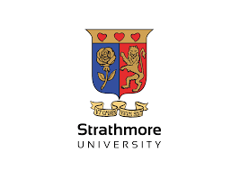

# R Code Repository



This repository contains R scripts that I used to conduct analysis for my Master's thesis in Statistical Science at Strathmore University.

We use a dedicated script, ```data_manager.R```, for data preparation, while ```thesisv2.Rmd``` contains the R code for analysis along with brief explanations of each section.

The detailed write up for the thesis was done using ```latex``` and can be found online at https://www.overleaf.com/read/kgrwvxgjpxvh#1cda32
